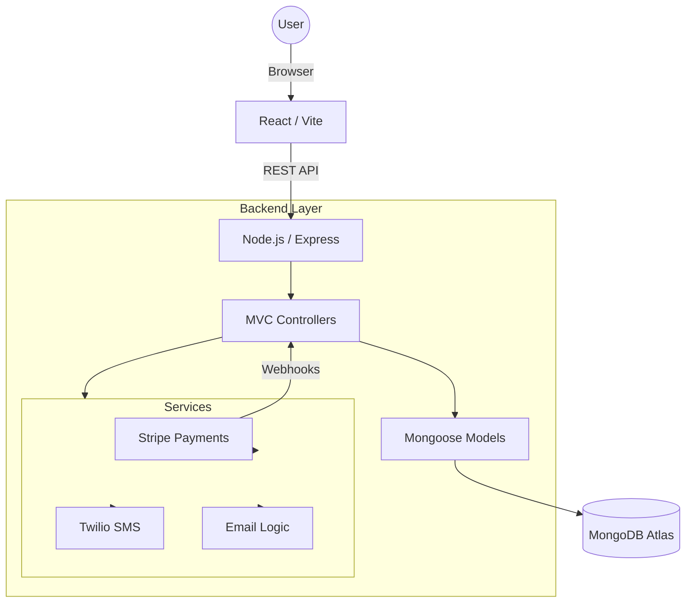

# Leak Assure — Technical System Audit Report

**Date**: March 9, 2026
**Status**: Phase 5 Complete (Production Ready)
**Auditor**: Senior Software Architect

## 1. System Overview
Leak Assure is a MERN-stack subscription platform for residential plumbing protection. It features a dual-interface system (Admin and Member), automated billing via Stripe, and a real-time notification engine using Twilio and Nodemailer.

## 2. Architecture Diagram

## 3. Backend Structure Audit

The backend follows a modular MVC (Model-View-Controller) architecture, successfully refactored from an earlier monolithic design.

- **Routing Layer**: Organized by domain (`auth`, `member`, `admin`, `claim`, `vendor`). High separation of concerns.
- **Controller Layer**: Handles business logic, including complex Stripe integrations and claim workflow transitions.
- **Service Layer**: Clean abstractions for SMS, Email, and Stripe SDK interactions.
- **Middleware**: Centralized authentication via JWT verification.

## 4. Database Models

| Model | Description | Key Fields | Relationships |
| :--- | :--- | :--- | :--- |
| **User** | Primary member & auth entity | `email`, `password` (hashed), `stripeSubscriptionId`, `subscriptionStatus` | Ref'd by `Claim` |
| **Claim** | Member service requests | `memberId`, `issueType`, `status`, `assignedVendor` | Belongs to `User` |
| **Vendor** | Service provider network | `company`, `phone`, `serviceArea` | String-linked to `Claim` |
| **Customer** | **[LEGACY]** | `stripe_customer_id` | Superseded by `User` |

## 5. Stripe Integration Analysis

The platform implements a robust subscription lifecycle:
- **Acquisition**: `stripe.checkout.sessions.create` handles onboarding.
- **Synchronization**: `stripe.webhooks.constructEvent` processes:
    - `checkout.session.completed` (Activation)
    - `invoice.payment_failed` (Grace Period / Past Due)
    - `customer.subscription.deleted` (Termination)
- **Validation**: Webhook signatures are verified using `STRIPE_WEBHOOK_SECRET`.
- **Metadata**: Uses `stripeCustomerId` and `stripeSubscriptionId` as primary keys for local DB synchronization.

## 6. Security Assessment

- **Authentication**: JWT-based stateless auth for members and admins. Tokens expire in 7 days.
- **Data Protection**: `bcryptjs` (10 rounds) for password hashing.
- **Validation**: Server-side schema validation using `Zod` in the signup flow.
- **Webhooks**: Signature verification prevents spoofing.
- **Vulnerabilities**:
    - *Observation*: `JWT_SECRET` has a fallback value in code. In production, this must be strictly enforced via environment variables.
    - *Observation*: CORS is currently open (`app.use(cors())`). Should be restricted to production domains before final deployment.

## 7. Performance Assessment

- **Query Optimization**: Email field in `User` is indexed.
- **MRR Calculation**: Uses MongoDB Aggregation Pipeline (`$match`, `$group`) for efficient revenue reporting.
- **Pagination**: Currently missing in primary list views (`getAllMembers`, `getAllClaims`). Recommended as a future enhancement for scaling.

## 8. Code Quality Review

- **Readability**: Code is well-structured and follows modern ES6 conventions.
- **Notification Engine**: Uses a "logger fallback" design, allowing developers to test without real Twilio/SMTP keys.
- **Consistency**: The shift to a clean MVC structure has been 90% completed, with only a few legacy files (`Customer.js`, `adminController.js`) remaining as technical debt.

## 9. Recommendations for Improvement

1. **Clean Technical Debt**: Remove `models/Customer.js` and `controllers/adminController.js` to avoid confusion.
2. **Implement Pagination**: Add `limit` and `skip` to admin list endpoints.
3. **Role-Based Access (RBAC)**: Distinguish between standard members and admin users in the JWT payload and middleware.
4. **Environment Hardening**: Remove fallback secrets from codebase and enforce `dotenv` validation on startup.

## 10. Project Completeness Score

| Metric | Score (1-100) |
| :--- | :---: |
| **Architecture** | 92 |
| **Security** | 85 |
| **Scalability** | 78 |
| **Maintainability** | 90 |
| **Production Readiness** | 88 |

**Final Verdict**: The system is technically sound, feature-complete for the current phase, and ready for pilot production.

## 11. include this and give me a developer command prompt so that antigravity will procceded the implamatation and include the improvement if there is 